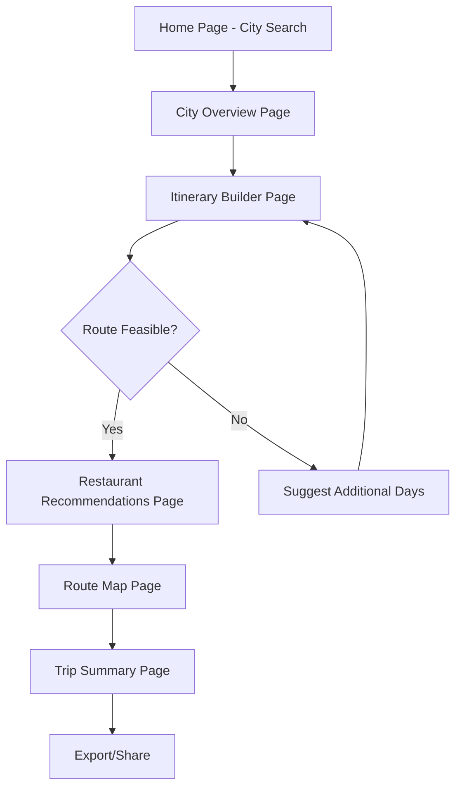

# AI Trip Planner - Product Requirements Document

## 1. Product Overview

An intelligent web application that helps users plan comprehensive city trips through AI-powered recommendations, drag-and-drop itinerary building, and route optimization.

The platform solves the complexity of trip planning by providing personalized recommendations, optimizing travel routes, and calculating realistic daily schedules based on user preferences and constraints. Target users include leisure travelers, business travelers, and travel enthusiasts seeking efficient and personalized trip planning experiences.

## 2. Core Features

### 2.1 User Roles

| Role            | Registration Method      | Core Permissions                                                          |
| --------------- | ------------------------ | ------------------------------------------------------------------------- |
| Guest User      | No registration required | Can search cities, view basic recommendations, limited itinerary planning |
| Registered User | Email registration       | Full access to all features, save itineraries, access trip history        |
| Premium User    | Subscription upgrade     | Advanced AI recommendations, unlimited saved trips, priority support      |

### 2.2 Feature Module

Our AI Trip Planner consists of the following main pages:

1. **Home page**: search interface, city selection, trip duration or vibe search options
2. **City overview page**: city information display, weather data, key attractions overview
3. **Itinerary builder page**: drag-and-drop interface, place cards with photos, route optimization
4. **Restaurant recommendations page**: dining suggestions, budget input, cuisine preferences
5. **Route map page**: Google Maps integration, hotel location input, transportation options
6. **Trip summary page**: final itinerary review, export options, sharing capabilities

### 2.3 Page Details

| Page Name                       | Module Name              | Feature description                                                      |
| ------------------------------- | ------------------------ | ------------------------------------------------------------------------ |
| Home page                       | Search Interface         | Input city name, select trip duration (days) or choose vibe-based search |
| Home page                       | Trip Type Selection      | Toggle between structured planning (days) and exploratory (vibe) modes   |
| City overview page              | City Information Display | Show city data, weather, best time to visit, cultural highlights         |
| City overview page              | Attraction Preview       | Display top attractions with photos and brief descriptions               |
| Itinerary builder page          | Place Cards Gallery      | Beautiful cards with photos, ratings, descriptions, estimated visit time |
| Itinerary builder page          | Drag & Drop Interface    | Drag places from gallery to daily itinerary slots                        |
| Itinerary builder page          | Route Optimization       | Calculate optimal routes, travel times, and daily schedules              |
| Itinerary builder page          | Day Planning Logic       | Analyze feasibility, suggest additional days if needed                   |
| Restaurant recommendations page | Dining Suggestions       | AI-powered restaurant recommendations based on location and preferences  |
| Restaurant recommendations page | Budget Integration       | Input budget range, filter restaurants by price category                 |
| Restaurant recommendations page | Cuisine Preferences      | Select preferred cuisines, dietary restrictions, meal types              |
| Route map page                  | Google Maps Integration  | Interactive map with pinned locations and route visualization            |
| Route map page                  | Hotel Location Input     | Add hotel address or select from suggestions                             |
| Route map page                  | Transportation Options   | Display multiple transport modes (walking, public transit, taxi, car)    |
| Route map page                  | Route Optimization       | Calculate most efficient routes between all locations                    |
| Trip summary page               | Itinerary Review         | Complete trip overview with timeline, costs, and logistics               |
| Trip summary page               | Export & Share           | Download PDF, share via link, save to account                            |

## 3. Core Process

**Main User Flow:**

1. User enters city name and selects trip duration or vibe search
2. System displays city overview with relevant information
3. User browses attraction cards and drags desired places to itinerary
4. System optimizes routes and calculates daily schedules
5. System prompts for restaurant recommendations and budget input
6. User inputs hotel location or selects accommodation
7. System generates optimized route map with transportation options
8. User reviews final itinerary and exports/shares trip plan

## 4. User Interface Design

### 4.1 Premium Design System

**Color Palette (Premium & Accessible):**

* Primary: Gradient from Deep Blue (#0F172A) to Royal Blue (#1E40AF)

* Secondary: Warm Orange (#F97316) to Amber (#F59E0B) gradient

* Neutral: True Gray scale (#F8FAFC, #E2E8F0, #64748B, #1E293B)

* Success: Emerald (#10B981), Warning: Amber (#F59E0B), Error: Rose (#EF4444)

* All colors meet WCAG 2.1 AA contrast requirements

**Typography (Modern & Elegant):**

* Primary Font: Geist (Vercel's premium font) or Inter fallback

* Font Sizes: 12px, 14px, 16px, 18px, 24px, 32px, 48px, 64px

* Line Heights: 1.2 (headings), 1.5 (body), 1.6 (reading)

* Font Weights: 400 (regular), 500 (medium), 600 (semibold), 700 (bold)

**Button Design (Premium Quality):**

* Primary: Gradient backgrounds with subtle shadows and glow effects

* Hover States: Smooth scale transforms (1.02x) with color transitions

* Active States: Slight scale down (0.98x) with haptic feedback

* Border Radius: 8px (standard), 12px (large), 6px (small)

* Micro-interactions: 200ms ease-out transitions

**Animation Standards:**

* Duration: 200ms (micro), 300ms (standard), 500ms (complex)

* Easing: cubic-bezier(0.4, 0, 0.2, 1) for smooth, natural motion

* Page Transitions: Slide and fade combinations

* Loading States: Skeleton screens with shimmer effects

* Hover Effects: Subtle scale, shadow, and color transitions

**Layout & Spacing:**

* Grid System: 12-column responsive grid with 24px gutters

* Spacing Scale: 4px, 8px, 12px, 16px, 24px, 32px, 48px, 64px

* Container Max-Width: 1200px with responsive breakpoints

* Card Design: Subtle shadows, rounded corners, hover elevations

**Component Quality Standards:**

* All interactive elements have focus states for accessibility

* Smooth loading states with skeleton screens

* Error states with helpful messaging and recovery actions

* Empty states with engaging illustrations and clear CTAs

* Consistent iconography using Lucide React (outline style)

### 4.2 Page Design Overview (Premium Implementation)

| Page Name                       | Module Name           | UI Elements                                                                                                                                   |
| ------------------------------- | --------------------- | --------------------------------------------------------------------------------------------------------------------------------------------- |
| Home page                       | Search Interface      | Animated gradient hero with floating search bar, smooth autocomplete with fade-in suggestions, elegant toggle buttons with sliding indicators |
| Home page                       | Hero Section          | Parallax background with subtle particle animations, smooth scroll-triggered animations, premium typography with letter-spacing               |
| City overview page              | Information Display   | Masonry grid with staggered animations, weather widget with smooth data transitions, photo carousel with momentum scrolling                   |
| City overview page              | Statistics Cards      | Floating cards with subtle shadows, hover elevations, animated counters, smooth icon transitions                                              |
| Itinerary builder page          | Drag & Drop Interface | Fluid drag animations with physics-based motion, ghost elements during drag, smooth snap-to-grid feedback                                     |
| Itinerary builder page          | Timeline View         | Animated timeline with progress indicators, smooth expand/collapse animations, elegant time slot visualizations                               |
| Restaurant recommendations page | Dining Cards          | Staggered grid animations on load, smooth filter transitions, elegant price range sliders with haptic feedback                                |
| Restaurant recommendations page | Budget Interface      | Animated budget calculator, smooth range inputs, real-time cost updates with smooth number transitions                                        |
| Route map page                  | Map Integration       | Smooth map animations, floating panels with backdrop blur, elegant transportation mode switcher                                               |
| Route map page                  | Route Visualization   | Animated route drawing, smooth marker transitions, elegant info windows with custom styling                                                   |
| Trip summary page               | Final Review          | Smooth accordion animations, elegant progress bars, premium export modal with loading animations                                              |

### 4.3 Responsive Design & Performance

**Breakpoint Strategy:**

* Mobile: 320px - 767px (touch-optimized)

* Tablet: 768px - 1023px (hybrid interactions)

* Desktop: 1024px - 1439px (mouse/keyboard)

* Large Desktop: 1440px+ (enhanced layouts)

**Mobile Optimizations:**

* Touch-friendly drag-and-drop with haptic feedback

* Swipe gestures for navigation and card interactions

* Bottom sheet modals for better thumb reach

* Simplified navigation with collapsible menus

* Optimized map interactions for touch devices

**Performance Standards:**

* Core Web Vitals: LCP < 2.5s, FID < 100ms, CLS < 0.1

* 60fps animations with GPU acceleration

* Progressive image loading with blur-up technique

* Code splitting and lazy loading for optimal bundle sizes

* Service worker for offline functionality

**Accessibility Compliance:**

* WCAG 2.1 AA compliance

* Keyboard navigation for all interactive elements

* Screen reader optimization with proper ARIA labels

* High contrast mode support

* Reduced motion preferences respected

**Progressive Web App Features:**

* Installable with custom splash screen

* Offline trip viewing and basic editing

* Push notifications for trip reminders

* Background sync for data updates