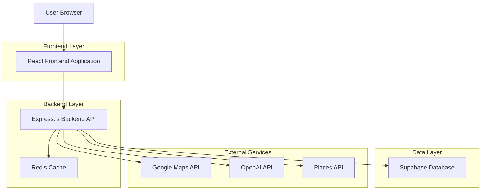
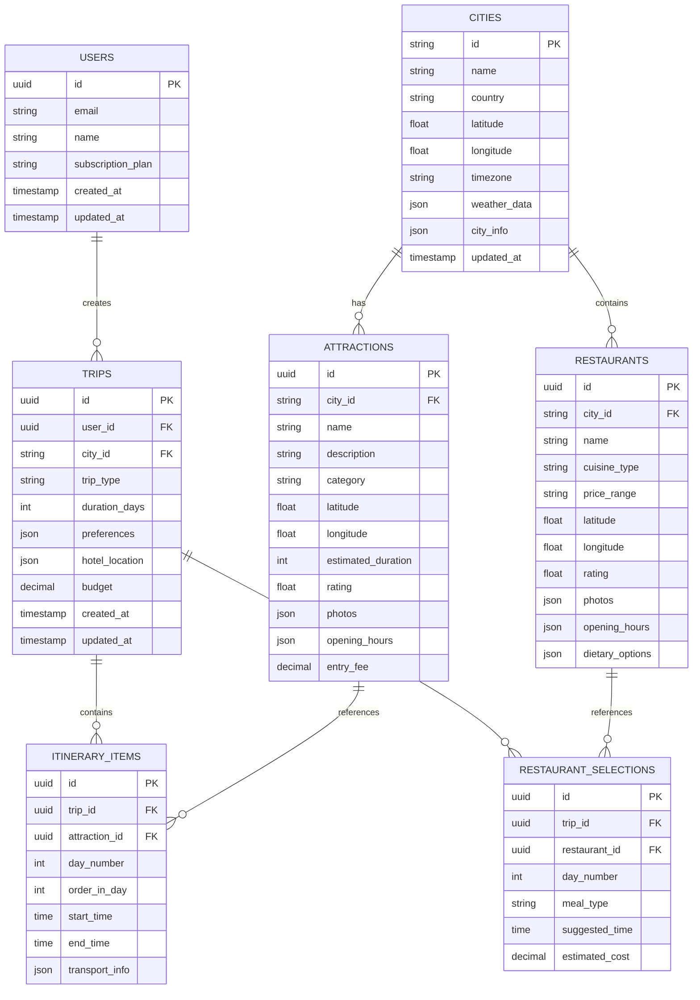

# AI Trip Planner - Technical Architecture Document

## 1. Architecture Design



## 2. Technology Description

**Frontend Stack (Premium & Stable):**
- Framework: Next.js 14 (App Router) + React 18 + TypeScript
- Styling: Tailwind CSS + CSS-in-JS for custom animations
- UI Components: Radix UI + shadcn/ui (premium component library)
- Animations: Framer Motion (smooth, quality animated motions)
- State Management: Zustand (lightweight, modern state management)
- Drag & Drop: @dnd-kit (modern, accessible drag-and-drop)
- Maps: Google Maps API + @googlemaps/react-wrapper
- Build Tool: Turbopack (Next.js native, faster than Vite)

**Backend Stack (Enterprise-Grade):**
- Runtime: Node.js + Express.js + TypeScript
- ORM: Prisma (type-safe database access)
- Database: PostgreSQL (Supabase) with connection pooling
- Cache: Redis (session management & API caching)
- Authentication: NextAuth.js v5 + Supabase Auth
- API: RESTful + GraphQL (Apollo Server)

**External Services:**
- Maps: Google Maps API, Google Places API, Google Directions API
- AI: OpenAI GPT-4 API (trip optimization)
- Image Processing: Cloudinary (optimized attraction photos)
- Email: Resend (transactional emails)

**Deployment & Infrastructure:**
- Frontend: Vercel (Edge Functions, global CDN)
- Backend: Railway (auto-scaling, managed infrastructure)
- Database: Supabase (managed PostgreSQL with real-time)
- Cache: Upstash Redis (serverless Redis)
- Monitoring: Sentry (error tracking) + Vercel Analytics

## 3. Route Definitions

| Route                | Purpose                                                        |
| -------------------- | -------------------------------------------------------------- |
| /                    | Home page with city search and trip type selection             |
| /city/:cityId        | City overview page displaying city information and attractions |
| /planner/:tripId     | Itinerary builder with drag-and-drop interface                 |
| /restaurants/:tripId | Restaurant recommendations based on itinerary and budget       |
| /map/:tripId         | Route optimization and Google Maps integration                 |
| /summary/:tripId     | Final trip summary and export options                          |
| /login               | User authentication page                                       |
| /profile             | User profile and saved trips                                   |

## 4. API Definitions

### 4.1 Core API

**City Search**

```
GET /api/cities/search?q={cityName}
```

Request:

| Param Name | Param Type | isRequired | Description         |
| ---------- | ---------- | ---------- | ------------------- |
| q          | string     | true       | City name to search |

Response:

| Param Name | Param Type | Description                             |
| ---------- | ---------- | --------------------------------------- |
| cities     | array      | List of matching cities with basic info |
| status     | boolean    | Request success status                  |

Example:

```json
{
  "cities": [
    {
      "id": "paris-france",
      "name": "Paris",
      "country": "France",
      "coordinates": [48.8566, 2.3522],
      "timezone": "Europe/Paris"
    }
  ],
  "status": true
}
```

**Trip Creation**

```
POST /api/trips
```

Request:

| Param Name  | Param Type | isRequired | Description                               |
| ----------- | ---------- | ---------- | ----------------------------------------- |
| cityId      | string     | true       | Selected city identifier                  |
| duration    | number     | false      | Number of days (optional for vibe search) |
| tripType    | string     | true       | "structured" or "vibe"                    |
| preferences | object     | false      | User preferences and interests            |

Response:

| Param Name  | Param Type | Description               |
| ----------- | ---------- | ------------------------- |
| tripId      | string     | Unique trip identifier    |
| cityData    | object     | Detailed city information |
| attractions | array      | Recommended attractions   |
| status      | boolean    | Request success status    |

**Itinerary Optimization**

```
POST /api/trips/{tripId}/optimize
```

Request:

| Param Name     | Param Type | isRequired | Description                            |
| -------------- | ---------- | ---------- | -------------------------------------- |
| selectedPlaces | array      | true       | List of selected attraction IDs        |
| hotelLocation  | object     | false      | Hotel coordinates                      |
| preferences    | object     | false      | Time preferences, mobility constraints |

Response:

| Param Name          | Param Type | Description                      |
| ------------------- | ---------- | -------------------------------- |
| optimizedItinerary  | object     | Day-by-day optimized schedule    |
| routeData           | object     | Transportation routes and times  |
| feasibilityAnalysis | object     | Analysis of schedule feasibility |
| suggestions         | array      | Recommendations for improvements |

**Restaurant Recommendations**

```
GET /api/trips/{tripId}/restaurants?budget={budget}&cuisine={cuisine}
```

Request:

| Param Name | Param Type | isRequired | Description                      |
| ---------- | ---------- | ---------- | -------------------------------- |
| budget     | string     | true       | Budget range (low, medium, high) |
| cuisine    | string     | false      | Preferred cuisine type           |
| dietary    | array      | false      | Dietary restrictions             |

Response:

| Param Name         | Param Type | Description                          |
| ------------------ | ---------- | ------------------------------------ |
| restaurants        | array      | Recommended restaurants with details |
| mealPlan           | object     | Suggested meal schedule              |
| totalEstimatedCost | number     | Estimated dining costs               |

## 5. Server Architecture Diagram

```mermaid
graph TD
    A[Client / Frontend] --> B[API Gateway / Router]
    B --> C[Authentication Middleware]
    C --> D[Controller Layer]
    D --> E[Service Layer]
    E --> F[Repository Layer]
    F --> G[(Supabase Database)]
    E --> H[External API Services]
    E --> I[Cache Layer (Redis)]
    
    subgraph "External Services"
        H1[Google Maps API]
        H2[OpenAI API]
        H3[Places API]
        H --> H1
        H --> H2
        H --> H3
    end

    subgraph Server
        B
        C
        D
        E
        F
        I
    end
```

## 6. Data Model

### 6.1 Data Model Definition



### 6.2 Data Definition Language

**Users Table**

```sql
CREATE TABLE users (
    id UUID PRIMARY KEY DEFAULT gen_random_uuid(),
    email VARCHAR(255) UNIQUE NOT NULL,
    name VARCHAR(100) NOT NULL,
    subscription_plan VARCHAR(20) DEFAULT 'free' CHECK (subscription_plan IN ('free', 'premium')),
    created_at TIMESTAMP WITH TIME ZONE DEFAULT NOW(),
    updated_at TIMESTAMP WITH TIME ZONE DEFAULT NOW()
);

-- Enable RLS
ALTER TABLE users ENABLE ROW LEVEL SECURITY;

-- Policies
CREATE POLICY "Users can view own profile" ON users FOR SELECT USING (auth.uid() = id);
CREATE POLICY "Users can update own profile" ON users FOR UPDATE USING (auth.uid() = id);

-- Permissions
GRANT SELECT ON users TO anon;
GRANT ALL PRIVILEGES ON users TO authenticated;
```

**Cities Table**

```sql
CREATE TABLE cities (
    id VARCHAR(50) PRIMARY KEY,
    name VARCHAR(100) NOT NULL,
    country VARCHAR(100) NOT NULL,
    latitude DECIMAL(10, 8) NOT NULL,
    longitude DECIMAL(11, 8) NOT NULL,
    timezone VARCHAR(50) NOT NULL,
    weather_data JSONB,
    city_info JSONB,
    updated_at TIMESTAMP WITH TIME ZONE DEFAULT NOW()
);

CREATE INDEX idx_cities_name ON cities(name);
CREATE INDEX idx_cities_country ON cities(country);

GRANT SELECT ON cities TO anon;
GRANT ALL PRIVILEGES ON cities TO authenticated;
```

**Attractions Table**

```sql
CREATE TABLE attractions (
    id UUID PRIMARY KEY DEFAULT gen_random_uuid(),
    city_id VARCHAR(50) REFERENCES cities(id),
    name VARCHAR(200) NOT NULL,
    description TEXT,
    category VARCHAR(50) NOT NULL,
    latitude DECIMAL(10, 8) NOT NULL,
    longitude DECIMAL(11, 8) NOT NULL,
    estimated_duration INTEGER NOT NULL, -- in minutes
    rating DECIMAL(3, 2),
    photos JSONB,
    opening_hours JSONB,
    entry_fee DECIMAL(10, 2)
);

CREATE INDEX idx_attractions_city_id ON attractions(city_id);
CREATE INDEX idx_attractions_category ON attractions(category);
CREATE INDEX idx_attractions_rating ON attractions(rating DESC);

GRANT SELECT ON attractions TO anon;
GRANT ALL PRIVILEGES ON attractions TO authenticated;
```

**Trips Table**

```sql
CREATE TABLE trips (
    id UUID PRIMARY KEY DEFAULT gen_random_uuid(),
    user_id UUID REFERENCES users(id),
    city_id VARCHAR(50) REFERENCES cities(id),
    trip_type VARCHAR(20) NOT NULL CHECK (trip_type IN ('structured', 'vibe')),
    duration_days INTEGER,
    preferences JSONB,
    hotel_location JSONB,
    budget DECIMAL(10, 2),
    created_at TIMESTAMP WITH TIME ZONE DEFAULT NOW(),
    updated_at TIMESTAMP WITH TIME ZONE DEFAULT NOW()
);

-- Enable RLS
ALTER TABLE trips ENABLE ROW LEVEL SECURITY;

-- Policies
CREATE POLICY "Users can view own trips" ON trips FOR SELECT USING (auth.uid() = user_id);
CREATE POLICY "Users can create trips" ON trips FOR INSERT WITH CHECK (auth.uid() = user_id);
CREATE POLICY "Users can update own trips" ON trips FOR UPDATE USING (auth.uid() = user_id);

CREATE INDEX idx_trips_user_id ON trips(user_id);
CREATE INDEX idx_trips_city_id ON trips(city_id);

GRANT SELECT ON trips TO anon;
GRANT ALL PRIVILEGES ON trips TO authenticated;
```

**Initial Data**

```sql
-- Sample cities
INSERT INTO cities (id, name, country, latitude, longitude, timezone) VALUES
('paris-france', 'Paris', 'France', 48.8566, 2.3522, 'Europe/Paris'),
('london-uk', 'London', 'United Kingdom', 51.5074, -0.1278, 'Europe/London'),
('tokyo-japan', 'Tokyo', 'Japan', 35.6762, 139.6503, 'Asia/Tokyo'),
('new-york-usa', 'New York', 'United States', 40.7128, -74.0060, 'America/New_York');

-- Sample attractions for Paris
INSERT INTO attractions (city_id, name, description, category, latitude, longitude, estimated_duration, rating, entry_fee) VALUES
('paris-france', 'Eiffel Tower', 'Iconic iron lattice tower and symbol of Paris', 'landmark', 48.8584, 2.2945, 120, 4.6, 25.90),
('paris-france', 'Louvre Museum', 'World\'s largest art museum and historic monument', 'museum', 48.8606, 2.3376, 180, 4.5, 17.00),
('paris-france', 'Notre-Dame Cathedral', 'Medieval Catholic cathedral with Gothic architecture', 'religious', 48.8530, 2.3499, 90, 4.4, 0.00);
```