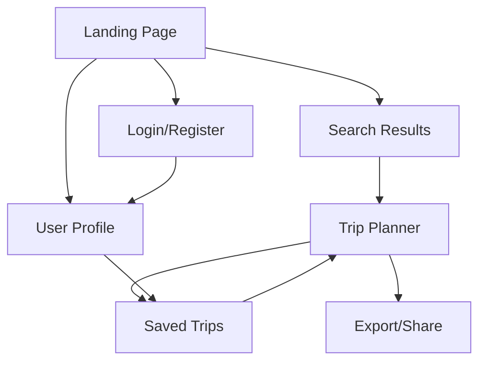
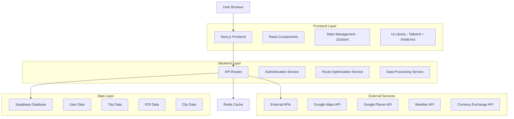
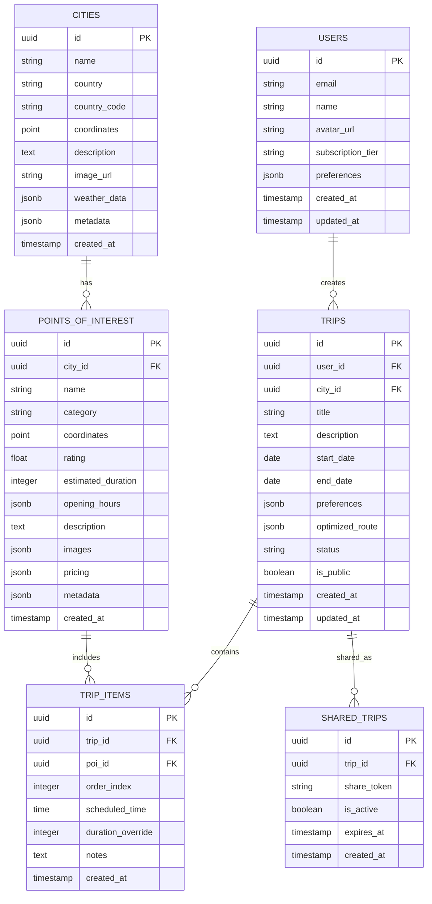

# Trip Planner - Product Requirements Document (PDR)

## 1. Product Overview

Trip Planner is an interactive web application for travel planning that allows users to create personalized itineraries through an intuitive drag & drop interface. The application automatically optimizes routes based on user selections and provides real-time visualization through Google Maps.

- **Problem to solve**: Travelers need a visual and interactive tool to efficiently plan their itineraries, optimizing time and distances between points of interest.
- **Target users**: Individual travelers, families, groups of friends, and travel agents seeking to create optimized itineraries.
- **Market value**: Simplify travel planning through route optimization technology and superior user experience.

## 2. Core Features

### 2.1 User Roles

| Role | Registration Method | Core Permissions |
|------|---------------------|------------------|
| Guest User | No registration required | Can search cities, view basic information, create temporary itineraries (session-based) |
| Registered User | Email registration + verification | Can save itineraries, access history, share plans, export routes |
| Premium User | Subscription upgrade | Advanced optimization algorithms, offline maps, unlimited saved itineraries, priority support |

### 2.2 Feature Module

Our Trip Planner application consists of the following main pages:

1. **Landing Page**: hero section with main search, navigation, testimonials and featured characteristics.
2. **Search Results Page**: city search results with basic information and quick access to the planner.
3. **Trip Planner Page**: main interface with city information, drag & drop points of interest, route timeline, and interactive map.
4. **Saved Trips Page**: management of saved itineraries with editing and sharing options.
5. **User Profile Page**: account configuration, travel preferences, and subscription management.

### 2.3 Page Details

| Page Name | Module Name | Feature description |
|-----------|-------------|---------------------|
| Landing Page | Hero Search Section | Implement city search with autocomplete, geolocation detection, popular destinations carousel |
| Landing Page | Features Showcase | Display key features with interactive demos, user testimonials, pricing tiers |
| Landing Page | Navigation Header | Provide user authentication, language selection, responsive menu |
| Search Results | City Cards Grid | Show city overview cards with key metrics, weather, best time to visit, quick plan button |
| Search Results | Filters & Sorting | Enable filtering by region, season, budget, activity type with real-time results |
| Trip Planner | City Information Panel | Display comprehensive city data including weather, currency, language, local tips, emergency contacts |
| Trip Planner | Points of Interest Cards | Render draggable cards with attraction details, ratings, estimated visit time, opening hours, photos |
| Trip Planner | Drag & Drop Interface | Enable intuitive drag and drop from POI cards to timeline with visual feedback and validation |
| Trip Planner | Interactive Timeline | Provide editable timeline with time slots, reordering capabilities, duration estimates, travel time calculations |
| Trip Planner | Route Optimization Engine | Calculate optimal routes considering traffic, opening hours, user preferences, walking/driving distances |
| Trip Planner | Google Maps Integration | Display real-time map with route visualization, traffic conditions, alternative routes, street view |
| Trip Planner | Export & Share Tools | Generate PDF itineraries, share links, export to calendar apps, send to mobile devices |
| Saved Trips | Trip Management Dashboard | List saved trips with thumbnails, last modified dates, sharing status, quick actions |
| Saved Trips | Trip Editor | Provide inline editing capabilities, duplicate trips, template creation |
| User Profile | Account Settings | Manage personal information, notification preferences, privacy settings |
| User Profile | Travel Preferences | Configure default settings for transportation, budget range, activity preferences, accessibility needs |

## 3. Core Process

### Guest User Flow
1. User arrives at the landing page
2. Searches for a city using the main search
3. Views city results with basic information
4. Selects a city and accesses the planner
5. Explores points of interest and creates a temporary itinerary
6. Visualizes the optimized route on the map
7. Optionally registers to save the itinerary

### Registered User Flow
1. User logs in from the landing page
2. Accesses saved trips or creates a new one
3. Uses the advanced planner with all functionalities
4. Saves, edits and shares itineraries
5. Exports plans to different formats
6. Manages preferences and configurations

### Premium User Flow
1. Accesses advanced optimization algorithms
2. Uses offline maps and premium features
3. Creates unlimited itineraries with detailed analysis
4. Receives priority support and early updates



## 4. User Interface Design

### 4.1 Design Style

- **Primary colors**: 
  - Primary Blue: #2563EB (trust and professionalism)
  - Secondary Teal: #0D9488 (adventure and exploration)
  - Accent Orange: #EA580C (energy and action)
- **Secondary colors**:
  - Background: #F8FAFC (clean and modern)
  - Text Primary: #1E293B
  - Text Secondary: #64748B
  - Success: #059669
  - Warning: #D97706
  - Error: #DC2626
- **Button style**: Rounded corners (8px), subtle shadows, hover animations, gradient backgrounds for CTAs
- **Typography**: 
  - Primary: Inter (headings) - sizes 32px, 24px, 20px, 18px
  - Secondary: System fonts (body text) - sizes 16px, 14px, 12px
- **Layout style**: Card-based design, top navigation with sticky behavior, sidebar for filters, grid layouts for content
- **Icons and emojis**: Heroicons for UI elements, country flag emojis, activity-specific icons (🏛️, 🍽️, 🎨, 🏞️)

### 4.2 Page Design Overview

| Page Name | Module Name | UI Elements |
|-----------|-------------|-------------|
| Landing Page | Hero Section | Full-width background image, centered search bar with autocomplete dropdown, gradient overlay, animated typing effect for destinations |
| Landing Page | Features Grid | 3-column responsive grid, icon + title + description cards, hover animations, subtle shadows |
| Trip Planner | City Info Panel | Sticky top panel, weather widget, key stats in pill format, collapsible detailed information |
| Trip Planner | POI Cards | Grid layout, image thumbnails, rating stars, drag handles, category badges, estimated time chips |
| Trip Planner | Timeline | Horizontal scrollable timeline, time slots with drag zones, connecting lines, duration indicators |
| Trip Planner | Map Container | Full-height right panel, custom map markers, route polylines, zoom controls, layer toggles |
| Saved Trips | Trip Cards | Masonry layout, trip thumbnails, metadata overlay, action buttons on hover, status indicators |

### 4.3 Responsiveness

- **Desktop-first approach** with complete mobile adaptation
- **Breakpoints**: 
  - Desktop: 1024px+
  - Tablet: 768px - 1023px
  - Mobile: 320px - 767px
- **Touch optimization**: Larger touch targets (44px minimum), swipe gestures for timeline, pinch-to-zoom on maps
- **Progressive enhancement**: Core functionality works without JavaScript, enhanced experience with full interactivity

## 5. Technical Architecture

### 5.1 Architecture Overview



### 5.2 Technology Stack

- **Frontend**: Next.js@15.2.4 + React@19 + TypeScript@5 + Tailwind CSS@3.4.17 + shadcn/ui + Radix UI
- **UI Components**: @radix-ui/react-* (complete suite), Lucide React@0.454.0, Framer Motion
- **Forms & Validation**: React Hook Form + Zod@3.24.1 + @hookform/resolvers
- **Styling**: Tailwind CSS@3.4.17 + tailwindcss-animate + class-variance-authority + clsx + tailwind-merge
- **State Management**: React Context + useState/useReducer (following current landing pattern)
- **Notifications**: Sonner@1.7.1 (toast notifications)
- **Backend**: Next.js API Routes + Supabase
- **Database**: Supabase (PostgreSQL)
- **Caching**: Upstash Redis (already integrated in the project)
- **Maps**: Google Maps JavaScript API + Google Places API
- **Authentication**: Supabase Auth
- **Deployment**: Vercel
- **Monitoring**: Vercel Analytics + Sentry

### 5.3 Route Definitions

| Route | Purpose |
|-------|----------|
| / | Landing page with hero search and features |
| /search | City search results with filtering options |
| /plan/[cityId] | Main trip planner interface for specific city |
| /trips | User's saved trips dashboard |
| /trips/[tripId] | Individual trip editor and viewer |
| /profile | User profile and preferences management |
| /auth/login | User authentication page |
| /auth/register | User registration page |
| /api/cities/search | City search and autocomplete API |
| /api/cities/[id] | City details and POI data |
| /api/trips | CRUD operations for user trips |
| /api/optimize-route | Route optimization algorithm |
| /api/places/nearby | Google Places integration |

### 5.4 API Definitions

#### 5.4.1 Core APIs

**City Search**
```
GET /api/cities/search?q={query}&limit={limit}
```

Request:
| Param Name | Param Type | isRequired | Description |
|------------|------------|------------|-------------|
| q | string | true | Search query for city name |
| limit | number | false | Maximum results to return (default: 10) |

Response:
```json
{
  "cities": [
    {
      "id": "city_123",
      "name": "Barcelona",
      "country": "Spain",
      "coordinates": { "lat": 41.3851, "lng": 2.1734 },
      "description": "Vibrant Mediterranean city...",
      "image": "https://...",
      "bestTimeToVisit": "April-June, September-October"
    }
  ],
  "total": 1
}
```

**Points of Interest**
```
GET /api/cities/{cityId}/poi?category={category}&limit={limit}
```

Request:
| Param Name | Param Type | isRequired | Description |
|------------|------------|------------|-------------|
| cityId | string | true | City identifier |
| category | string | false | POI category filter |
| limit | number | false | Maximum results (default: 50) |

Response:
```json
{
  "poi": [
    {
      "id": "poi_456",
      "name": "Sagrada Familia",
      "category": "attraction",
      "coordinates": { "lat": 41.4036, "lng": 2.1744 },
      "rating": 4.7,
      "estimatedDuration": 120,
      "openingHours": "09:00-18:00",
      "description": "Iconic basilica designed by Antoni Gaudí",
      "images": ["https://..."],
      "ticketPrice": { "adult": 26, "currency": "EUR" }
    }
  ]
}
```

**Route Optimization**
```
POST /api/optimize-route
```

Request:
```json
{
  "startLocation": { "lat": 41.3851, "lng": 2.1734 },
  "endLocation": { "lat": 41.3851, "lng": 2.1734 },
  "waypoints": [
    {
      "id": "poi_456",
      "coordinates": { "lat": 41.4036, "lng": 2.1744 },
      "duration": 120,
      "priority": 1
    }
  ],
  "preferences": {
    "transportMode": "walking",
    "optimizeFor": "time",
    "maxWalkingDistance": 2000
  }
}
```

Response:
```json
{
  "optimizedRoute": {
    "waypoints": ["poi_456", "poi_789"],
    "totalDuration": 480,
    "totalDistance": 5200,
    "routes": [
      {
        "from": "start",
        "to": "poi_456",
        "duration": 15,
        "distance": 800,
        "mode": "walking"
      }
    ]
  }
}
```

**Trip Management**
```
POST /api/trips
GET /api/trips
PUT /api/trips/{tripId}
DELETE /api/trips/{tripId}
```

### 5.5 Data Model

#### 5.5.1 Database Schema



#### 5.5.2 Data Definition Language

**Users Table**
```sql
CREATE TABLE users (
    id UUID PRIMARY KEY DEFAULT gen_random_uuid(),
    email VARCHAR(255) UNIQUE NOT NULL,
    name VARCHAR(100) NOT NULL,
    avatar_url TEXT,
    subscription_tier VARCHAR(20) DEFAULT 'free' CHECK (subscription_tier IN ('free', 'premium')),
    preferences JSONB DEFAULT '{}',
    created_at TIMESTAMP WITH TIME ZONE DEFAULT NOW(),
    updated_at TIMESTAMP WITH TIME ZONE DEFAULT NOW()
);

CREATE INDEX idx_users_email ON users(email);
CREATE INDEX idx_users_subscription ON users(subscription_tier);
```

**Cities Table**
```sql
CREATE TABLE cities (
    id UUID PRIMARY KEY DEFAULT gen_random_uuid(),
    name VARCHAR(100) NOT NULL,
    country VARCHAR(100) NOT NULL,
    country_code VARCHAR(3) NOT NULL,
    coordinates POINT NOT NULL,
    description TEXT,
    image_url TEXT,
    weather_data JSONB DEFAULT '{}',
    metadata JSONB DEFAULT '{}',
    created_at TIMESTAMP WITH TIME ZONE DEFAULT NOW()
);

CREATE INDEX idx_cities_name ON cities(name);
CREATE INDEX idx_cities_country ON cities(country);
CREATE INDEX idx_cities_coordinates ON cities USING GIST(coordinates);
```

**Points of Interest Table**
```sql
CREATE TABLE points_of_interest (
    id UUID PRIMARY KEY DEFAULT gen_random_uuid(),
    city_id UUID NOT NULL REFERENCES cities(id) ON DELETE CASCADE,
    name VARCHAR(200) NOT NULL,
    category VARCHAR(50) NOT NULL,
    coordinates POINT NOT NULL,
    rating DECIMAL(2,1) CHECK (rating >= 0 AND rating <= 5),
    estimated_duration INTEGER, -- in minutes
    opening_hours JSONB DEFAULT '{}',
    description TEXT,
    images JSONB DEFAULT '[]',
    pricing JSONB DEFAULT '{}',
    metadata JSONB DEFAULT '{}',
    created_at TIMESTAMP WITH TIME ZONE DEFAULT NOW()
);

CREATE INDEX idx_poi_city ON points_of_interest(city_id);
CREATE INDEX idx_poi_category ON points_of_interest(category);
CREATE INDEX idx_poi_rating ON points_of_interest(rating DESC);
CREATE INDEX idx_poi_coordinates ON points_of_interest USING GIST(coordinates);
```

**Trips Table**
```sql
CREATE TABLE trips (
    id UUID PRIMARY KEY DEFAULT gen_random_uuid(),
    user_id UUID NOT NULL REFERENCES users(id) ON DELETE CASCADE,
    city_id UUID NOT NULL REFERENCES cities(id) ON DELETE CASCADE,
    title VARCHAR(200) NOT NULL,
    description TEXT,
    start_date DATE,
    end_date DATE,
    preferences JSONB DEFAULT '{}',
    optimized_route JSONB DEFAULT '{}',
    status VARCHAR(20) DEFAULT 'draft' CHECK (status IN ('draft', 'active', 'completed', 'archived')),
    is_public BOOLEAN DEFAULT FALSE,
    created_at TIMESTAMP WITH TIME ZONE DEFAULT NOW(),
    updated_at TIMESTAMP WITH TIME ZONE DEFAULT NOW()
);

CREATE INDEX idx_trips_user ON trips(user_id);
CREATE INDEX idx_trips_city ON trips(city_id);
CREATE INDEX idx_trips_status ON trips(status);
CREATE INDEX idx_trips_public ON trips(is_public) WHERE is_public = TRUE;
```

**Trip Items Table**
```sql
CREATE TABLE trip_items (
    id UUID PRIMARY KEY DEFAULT gen_random_uuid(),
    trip_id UUID NOT NULL REFERENCES trips(id) ON DELETE CASCADE,
    poi_id UUID NOT NULL REFERENCES points_of_interest(id) ON DELETE CASCADE,
    order_index INTEGER NOT NULL,
    scheduled_time TIME,
    duration_override INTEGER, -- in minutes
    notes TEXT,
    created_at TIMESTAMP WITH TIME ZONE DEFAULT NOW(),
    UNIQUE(trip_id, order_index)
);

CREATE INDEX idx_trip_items_trip ON trip_items(trip_id);
CREATE INDEX idx_trip_items_order ON trip_items(trip_id, order_index);
```

**Initial Data**
```sql
-- Sample cities
INSERT INTO cities (name, country, country_code, coordinates, description, image_url) VALUES
('Barcelona', 'Spain', 'ES', POINT(2.1734, 41.3851), 'Vibrant Mediterranean city known for its art, architecture, and beaches', 'https://example.com/barcelona.jpg'),
('Paris', 'France', 'FR', POINT(2.3522, 48.8566), 'The City of Light, famous for its museums, cuisine, and romantic atmosphere', 'https://example.com/paris.jpg'),
('Tokyo', 'Japan', 'JP', POINT(139.6917, 35.6895), 'Modern metropolis blending traditional culture with cutting-edge technology', 'https://example.com/tokyo.jpg');

-- Sample POIs for Barcelona
INSERT INTO points_of_interest (city_id, name, category, coordinates, rating, estimated_duration, description) VALUES
((SELECT id FROM cities WHERE name = 'Barcelona'), 'Sagrada Familia', 'attraction', POINT(2.1744, 41.4036), 4.7, 120, 'Iconic basilica designed by Antoni Gaudí'),
((SELECT id FROM cities WHERE name = 'Barcelona'), 'Park Güell', 'park', POINT(2.1527, 41.4145), 4.6, 90, 'Colorful park with mosaic art and city views'),
((SELECT id FROM cities WHERE name = 'Barcelona'), 'La Rambla', 'street', POINT(2.1741, 41.3825), 4.2, 60, 'Famous pedestrian street in the heart of Barcelona');
```

## 6. BMAD Implementation Plan (Build, Measure, Analyze, Deploy)

### BMAD Methodology
We will follow the BMAD methodology for iterative development:
- **Build**: Build minimum viable functionalities
- **Measure**: Measure performance and usability
- **Analyze**: Analyze data and feedback
- **Deploy**: Deploy incremental improvements

### PHASE 1: Foundation & Setup (Weeks 1-2)
**BUILD**
- ✅ Keep existing landing page intact
- Configure additional routes without affecting the main page
- Integrate Supabase into the existing project
- Create folder structure for the trip planner
- Configure environment variables for external APIs

**Technical Deliverables:**
```
/app/search/page.tsx          # New search route
/app/plan/[cityId]/page.tsx   # Planner route
```