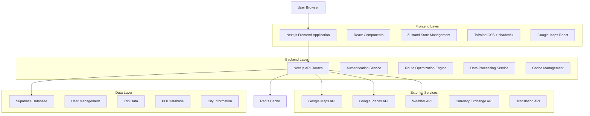
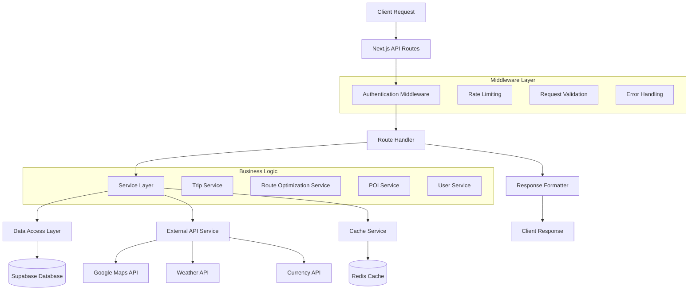
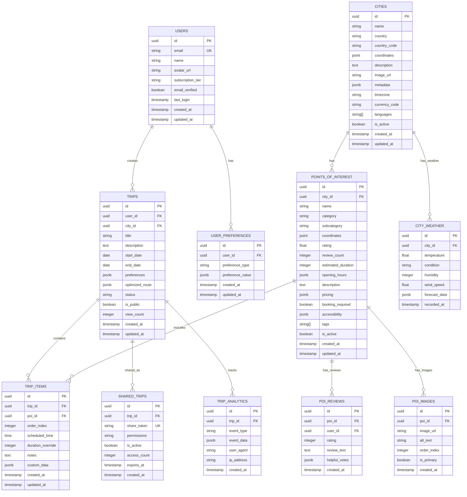

# Trip Planner - Technical Architecture Document

## 1. Architecture Design



## 2. Technology Description

- **Frontend**: Next.js@15.2.4 + React@19 + TypeScript@5 + Tailwind CSS@3.4.17
- **UI Framework**: shadcn/ui + Radix UI (complete suite) + Lucide React@0.454.0 + Framer Motion
- **Forms & Validation**: React Hook Form + Zod@3.24.1 + @hookform/resolvers
- **Styling**: tailwindcss-animate + class-variance-authority + clsx + tailwind-merge
- **State Management**: React Context + useState/useReducer (patrón del proyecto actual)
- **Notifications**: Sonner@1.7.1
- **Backend**: Next.js API Routes + Supabase
- **Database**: Supabase (PostgreSQL)
- **Caching**: Upstash Redis (ya integrado)
- **Maps**: Google Maps JavaScript API + Google Places API
- **Authentication**: Supabase Auth
- **Deployment**: Vercel

## 3. Route Definitions

| Route | Purpose |
|-------|----------|
| / | Landing page with hero search, features showcase, and user authentication |
| /search | City search results with filtering, sorting, and quick access to planner |
| /plan/[cityId] | Main trip planner interface with drag & drop, timeline, and map integration |
| /trips | User dashboard for managing saved trips with CRUD operations |
| /trips/[tripId] | Individual trip editor with full planning capabilities |
| /trips/[tripId]/share/[token] | Public trip sharing page for non-authenticated users |
| /profile | User profile management, preferences, and subscription settings |
| /auth/login | User authentication with social login options |
| /auth/register | User registration with email verification |
| /auth/callback | OAuth callback handler for social authentication |
| /premium | Premium subscription upgrade page with feature comparison |

## 4. API Definitions

### 4.1 Authentication APIs

**User Registration**
```
POST /api/auth/register
```

Request:
| Param Name | Param Type | isRequired | Description |
|------------|------------|------------|-------------|
| email | string | true | User email address |
| password | string | true | User password (min 8 characters) |
| name | string | true | User full name |
| preferences | object | false | Initial user preferences |

Response:
```json
{
  "user": {
    "id": "user_123",
    "email": "user@example.com",
    "name": "John Doe",
    "subscription_tier": "free"
  },
  "session": {
    "access_token": "jwt_token",
    "refresh_token": "refresh_token",
    "expires_at": 1234567890
  }
}
```

### 4.2 City and POI APIs

**City Search with Autocomplete**
```
GET /api/cities/search?q={query}&limit={limit}&country={country}
```

Request:
| Param Name | Param Type | isRequired | Description |
|------------|------------|------------|-------------|
| q | string | true | Search query (minimum 2 characters) |
| limit | number | false | Maximum results to return (default: 10, max: 50) |
| country | string | false | Country code filter (ISO 3166-1 alpha-2) |

Response:
```json
{
  "cities": [
    {
      "id": "city_barcelona_es",
      "name": "Barcelona",
      "country": "Spain",
      "country_code": "ES",
      "coordinates": {
        "lat": 41.3851,
        "lng": 2.1734
      },
      "description": "Vibrant Mediterranean city known for its art and architecture",
      "image_url": "https://images.example.com/barcelona.jpg",
      "best_time_to_visit": "April-June, September-October",
      "timezone": "Europe/Madrid",
      "currency": "EUR",
      "language": "Spanish, Catalan"
    }
  ],
  "total": 1,
  "has_more": false
}
```

**City Details and POI**
```
GET /api/cities/{cityId}/details?include_poi={boolean}&category={category}
```

Request:
| Param Name | Param Type | isRequired | Description |
|------------|------------|------------|-------------|
| cityId | string | true | City identifier |
| include_poi | boolean | false | Include points of interest (default: true) |
| category | string | false | Filter POI by category |

Response:
```json
{
  "city": {
    "id": "city_barcelona_es",
    "name": "Barcelona",
    "country": "Spain",
    "coordinates": { "lat": 41.3851, "lng": 2.1734 },
    "weather": {
      "current_temp": 22,
      "condition": "sunny",
      "forecast": []
    },
    "currency": {
      "code": "EUR",
      "symbol": "€",
      "exchange_rate": 1.0
    },
    "local_info": {
      "emergency_number": "112",
      "timezone": "Europe/Madrid",
      "language": "Spanish, Catalan",
      "tipping_culture": "5-10% in restaurants"
    }
  },
  "poi": [
    {
      "id": "poi_sagrada_familia",
      "name": "Sagrada Familia",
      "category": "attraction",
      "subcategory": "religious_site",
      "coordinates": { "lat": 41.4036, "lng": 2.1744 },
      "rating": 4.7,
      "review_count": 125000,
      "estimated_duration": 120,
      "opening_hours": {
        "monday": "09:00-18:00",
        "tuesday": "09:00-18:00",
        "wednesday": "09:00-18:00",
        "thursday": "09:00-18:00",
        "friday": "09:00-18:00",
        "saturday": "09:00-18:00",
        "sunday": "10:30-18:00"
      },
      "description": "Iconic basilica designed by Antoni Gaudí, UNESCO World Heritage Site",
      "images": [
        "https://images.example.com/sagrada_1.jpg",
        "https://images.example.com/sagrada_2.jpg"
      ],
      "pricing": {
        "adult": 26,
        "student": 24,
        "senior": 21,
        "currency": "EUR"
      },
      "booking_required": true,
      "accessibility": {
        "wheelchair_accessible": true,
        "audio_guide": true
      },
      "tags": ["architecture", "religious", "unesco", "gaudi"]
    }
  ],
  "categories": [
    { "id": "attraction", "name": "Attractions", "count": 45 },
    { "id": "restaurant", "name": "Restaurants", "count": 120 },
    { "id": "museum", "name": "Museums", "count": 28 }
  ]
}
```

### 4.3 Trip Management APIs

**Create Trip**
```
POST /api/trips
```

Request:
```json
{
  "city_id": "city_barcelona_es",
  "title": "Barcelona Adventure 2024",
  "description": "A 3-day exploration of Barcelona's best attractions",
  "start_date": "2024-06-15",
  "end_date": "2024-06-17",
  "preferences": {
    "transport_mode": "walking",
    "budget_range": "medium",
    "interests": ["architecture", "food", "culture"],
    "accessibility_needs": false,
    "group_size": 2
  }
}
```

Response:
```json
{
  "trip": {
    "id": "trip_abc123",
    "user_id": "user_123",
    "city_id": "city_barcelona_es",
    "title": "Barcelona Adventure 2024",
    "description": "A 3-day exploration of Barcelona's best attractions",
    "start_date": "2024-06-15",
    "end_date": "2024-06-17",
    "status": "draft",
    "is_public": false,
    "created_at": "2024-01-15T10:30:00Z",
    "updated_at": "2024-01-15T10:30:00Z"
  }
}
```

**Add POI to Trip**
```
POST /api/trips/{tripId}/items
```

Request:
```json
{
  "poi_id": "poi_sagrada_familia",
  "order_index": 1,
  "scheduled_time": "10:00",
  "duration_override": 90,
  "notes": "Book tickets in advance"
}
```

### 4.4 Route Optimization API

**Optimize Trip Route**
```
POST /api/trips/{tripId}/optimize
```

Request:
```json
{
  "optimization_type": "time",
  "transport_mode": "walking",
  "start_location": {
    "lat": 41.3851,
    "lng": 2.1734,
    "name": "Hotel Barcelona Center"
  },
  "end_location": {
    "lat": 41.3851,
    "lng": 2.1734,
    "name": "Hotel Barcelona Center"
  },
  "constraints": {
    "max_walking_distance": 2000,
    "avoid_tolls": true,
    "avoid_highways": false,
    "time_windows": {
      "start_time": "09:00",
      "end_time": "18:00"
    }
  }
}
```

Response:
```json
{
  "optimized_route": {
    "total_duration": 480,
    "total_distance": 5200,
    "total_cost": 45.50,
    "waypoints": [
      {
        "poi_id": "poi_sagrada_familia",
        "order": 1,
        "arrival_time": "10:00",
        "departure_time": "11:30",
        "duration": 90
      },
      {
        "poi_id": "poi_park_guell",
        "order": 2,
        "arrival_time": "12:15",
        "departure_time": "13:45",
        "duration": 90
      }
    ],
    "routes": [
      {
        "from": "start",
        "to": "poi_sagrada_familia",
        "duration": 15,
        "distance": 800,
        "mode": "walking",
        "polyline": "encoded_polyline_string",
        "instructions": [
          {
            "text": "Head north on Carrer de Mallorca",
            "distance": 200,
            "duration": 3
          }
        ]
      }
    ]
  },
  "alternatives": [
    {
      "name": "Scenic Route",
      "total_duration": 520,
      "total_distance": 6100,
      "description": "Longer route with better views"
    }
  ]
}
```

### 4.5 Sharing and Export APIs

**Generate Share Link**
```
POST /api/trips/{tripId}/share
```

Request:
```json
{
  "expires_in": 2592000,
  "permissions": "view"
}
```

Response:
```json
{
  "share_token": "share_xyz789",
  "share_url": "https://tripplanner.com/trips/trip_abc123/share/share_xyz789",
  "expires_at": "2024-02-15T10:30:00Z"
}
```

**Export Trip**
```
GET /api/trips/{tripId}/export?format={format}
```

Request:
| Param Name | Param Type | isRequired | Description |
|------------|------------|------------|-------------|
| format | string | true | Export format: "pdf", "ical", "json", "gpx" |

Response: Binary file download or JSON data depending on format

## 5. Server Architecture Diagram



## 6. Data Model

### 6.1 Enhanced Entity Relationship Diagram



### 6.2 Advanced Data Definition Language

**Enhanced Users Table with Subscription Management**
```sql
CREATE TABLE users (
    id UUID PRIMARY KEY DEFAULT gen_random_uuid(),
    email VARCHAR(255) UNIQUE NOT NULL,
    name VARCHAR(100) NOT NULL,
    avatar_url TEXT,
    subscription_tier VARCHAR(20) DEFAULT 'free' CHECK (subscription_tier IN ('free', 'premium', 'enterprise')),
    email_verified BOOLEAN DEFAULT FALSE,
    last_login TIMESTAMP WITH TIME ZONE,
    subscription_expires_at TIMESTAMP WITH TIME ZONE,
    created_at TIMESTAMP WITH TIME ZONE DEFAULT NOW(),
    updated_at TIMESTAMP WITH TIME ZONE DEFAULT NOW()
);

-- Indexes for performance
CREATE INDEX idx_users_email ON users(email);
CREATE INDEX idx_users_subscription ON users(subscription_tier);
CREATE INDEX idx_users_last_login ON users(last_login DESC);

-- Row Level Security
ALTER TABLE users ENABLE ROW LEVEL SECURITY;
CREATE POLICY "Users can view own profile" ON users FOR SELECT USING (auth.uid() = id);
CREATE POLICY "Users can update own profile" ON users FOR UPDATE USING (auth.uid() = id);
```

**Enhanced Cities Table with Comprehensive Data**
```sql
CREATE TABLE cities (
    id UUID PRIMARY KEY DEFAULT gen_random_uuid(),
    name VARCHAR(100) NOT NULL,
    country VARCHAR(100) NOT NULL,
    country_code VARCHAR(3) NOT NULL,
    coordinates POINT NOT NULL,
    description TEXT,
    image_url TEXT,
    timezone VARCHAR(50) NOT NULL,
    currency_code VARCHAR(3) NOT NULL,
    languages TEXT[] DEFAULT '{}',
    metadata JSONB DEFAULT '{}',
    is_active BOOLEAN DEFAULT TRUE,
    search_vector TSVECTOR,
    created_at TIMESTAMP WITH TIME ZONE DEFAULT NOW(),
    updated_at TIMESTAMP WITH TIME ZONE DEFAULT NOW()
);

-- Full-text search setup
CREATE INDEX idx_cities_search ON cities USING GIN(search_vector);
CREATE INDEX idx_cities_coordinates ON cities USING GIST(coordinates);
CREATE INDEX idx_cities_country ON cities(country_code);
CREATE INDEX idx_cities_active ON cities(is_active) WHERE is_active = TRUE;

-- Trigger for search vector updates
CREATE OR REPLACE FUNCTION update_cities_search_vector()
RETURNS TRIGGER AS $$
BEGIN
    NEW.search_vector := to_tsvector('english', COALESCE(NEW.name, '') || ' ' || COALESCE(NEW.country, '') || ' ' || COALESCE(NEW.description, ''));
    RETURN NEW;
END;
$$ LANGUAGE plpgsql;

CREATE TRIGGER cities_search_vector_update
    BEFORE INSERT OR UPDATE ON cities
    FOR EACH ROW EXECUTE FUNCTION update_cities_search_vector();
```

**Enhanced Points of Interest Table**
```sql
CREATE TABLE points_of_interest (
    id UUID PRIMARY KEY DEFAULT gen_random_uuid(),
    city_id UUID NOT NULL REFERENCES cities(id) ON DELETE CASCADE,
    name VARCHAR(200) NOT NULL,
    category VARCHAR(50) NOT NULL,
    subcategory VARCHAR(50),
    coordinates POINT NOT NULL,
    rating DECIMAL(2,1) CHECK (rating >= 0 AND rating <= 5),
    review_count INTEGER DEFAULT 0,
    estimated_duration INTEGER, -- in minutes
    opening_hours JSONB DEFAULT '{}',
    description TEXT,
    pricing JSONB DEFAULT '{}',
    booking_required BOOLEAN DEFAULT FALSE,
    accessibility JSONB DEFAULT '{}',
    tags TEXT[] DEFAULT '{}',
    is_active BOOLEAN DEFAULT TRUE,
    search_vector TSVECTOR,
    created_at TIMESTAMP WITH TIME ZONE DEFAULT NOW(),
    updated_at TIMESTAMP WITH TIME ZONE DEFAULT NOW()
);

-- Performance indexes
CREATE INDEX idx_poi_city ON points_of_interest(city_id);
CREATE INDEX idx_poi_category ON points_of_interest(category);
CREATE INDEX idx_poi_rating ON points_of_interest(rating DESC) WHERE is_active = TRUE;
CREATE INDEX idx_poi_coordinates ON points_of_interest USING GIST(coordinates);
CREATE INDEX idx_poi_search ON points_of_interest USING GIN(search_vector);
CREATE INDEX idx_poi_tags ON points_of_interest USING GIN(tags);

-- Search vector trigger
CREATE OR REPLACE FUNCTION update_poi_search_vector()
RETURNS TRIGGER AS $$
BEGIN
    NEW.search_vector := to_tsvector('english', 
        COALESCE(NEW.name, '') || ' ' || 
        COALESCE(NEW.category, '') || ' ' || 
        COALESCE(NEW.subcategory, '') || ' ' || 
        COALESCE(NEW.description, '') || ' ' ||
        COALESCE(array_to_string(NEW.tags, ' '), '')
    );
    RETURN NEW;
END;
$$ LANGUAGE plpgsql;

CREATE TRIGGER poi_search_vector_update
    BEFORE INSERT OR UPDATE ON points_of_interest
    FOR EACH ROW EXECUTE FUNCTION update_poi_search_vector();
```

**Enhanced Trips Table with Analytics**
```sql
CREATE TABLE trips (
    id UUID PRIMARY KEY DEFAULT gen_random_uuid(),
    user_id UUID NOT NULL REFERENCES users(id) ON DELETE CASCADE,
    city_id UUID NOT NULL REFERENCES cities(id) ON DELETE CASCADE,
    title VARCHAR(200) NOT NULL,
    description TEXT,
    start_date DATE,
    end_date DATE,
    preferences JSONB DEFAULT '{}',
    optimized_route JSONB DEFAULT '{}',
    status VARCHAR(20) DEFAULT 'draft' CHECK (status IN ('draft', 'active', 'completed', 'archived')),
    is_public BOOLEAN DEFAULT FALSE,
    view_count INTEGER DEFAULT 0,
    created_at TIMESTAMP WITH TIME ZONE DEFAULT NOW(),
    updated_at TIMESTAMP WITH TIME ZONE DEFAULT NOW()
);

-- Performance indexes
CREATE INDEX idx_trips_user ON trips(user_id);
CREATE INDEX idx_trips_city ON trips(city_id);
```